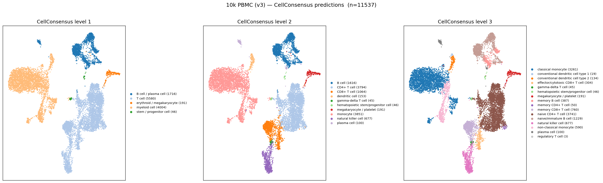
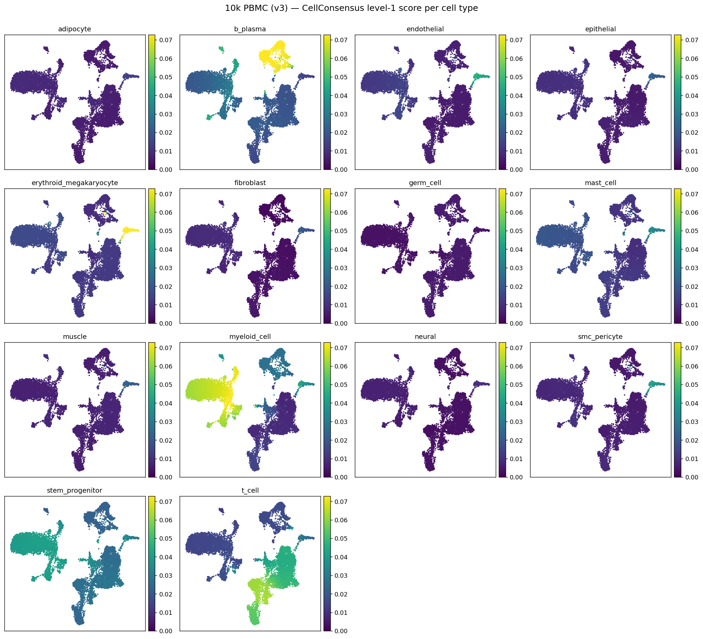

# CellConsensus

> ⚠️ **Heavy development.** API and outputs are evolving rapidly — breaking changes between versions should be expected. Pin a specific version if you need stability.

Hierarchical unsupervised cell type annotation from consensus marker genes — three levels of granularity, no reference atlas required, plus user-defined gene-set and cell-type scoring.

## Explore the database

Browse the underlying consensus marker database — per-cell-type marker lists, sources, and gene rankings — at **[cellconsensus.org](http://cellconsensus.org/)**.

The same database is exposed as an MCP server so AI assistants can query it conversationally (e.g. *"what are the markers for memory CD8+ T cells?"*, *"what is the cell type for this set of marker genes: LST1, FCER1G, AIF1, FTH1, IFITM2?"*):

```
https://wrbcaolmpdeefznfkqpj.supabase.co/functions/v1/mcp
```

**Claude:** Settings → Connectors → Add custom connector → paste the URL above.
**ChatGPT:** Settings → Apps → Advanced settings → enable Developer mode → Create Connector → paste the URL above.

https://github.com/user-attachments/assets/39d02a8a-e543-437a-a16e-243a80a32e10

## Installation

Latest release (1.1.0) from PyPI:

```bash
pip install cellconsensus
```

Or the latest development version from GitHub:

```bash
pip install git+https://github.com/tansey-lab/cellconsensus.git
```

## Usage

```python
from cellconsensus import CellConsensus
import scanpy as sc

adata = sc.read_h5ad("my_data.h5ad")

cc = CellConsensus()
cc.fit(adata, include_cancer=True, cancer_types=["lung_adenocarcinoma"])

labels_lvl1 = cc.predict(level=1)   # "T cell", "myeloid cell", ...
labels_lvl2 = cc.predict(level=2)   # "CD4+ T cell", "macrophage", ...
labels_lvl3 = cc.predict(level=3)   # "memory CD4+ T cell", ...

# Per-cell × per-type score matrix (DataFrame, n_cells x n_lvl1_types)
S = cc.score_matrix(level=1)

# Save / reload
cc.save("model.pkl")
cc2 = CellConsensus.load("model.pkl")
```

`cancer_types` accepts any key from `cellconsensus.list_cancer_types()` (120 entries including `lung_adenocarcinoma`, `breast_carcinoma`, `melanoma`, …). Omit `include_cancer` for normal-tissue-only fits. The available cell-type keys at each level are listed by `cellconsensus.load_cell_type(level=1|2|3)`.

## Example: 10k PBMC

[`examples/pbmc10k_example.py`](examples/pbmc10k_example.py) runs CellConsensus on 10x Genomics' public 10k PBMC (v3) dataset (~11.5k cells after light QC) and produces the figures below.

First, download the data (one-off, ~37 MB):

```bash
wget https://cf.10xgenomics.com/samples/cell-exp/3.0.0/pbmc_10k_v3/pbmc_10k_v3_filtered_feature_bc_matrix.h5
```

Then run:

```python
import scanpy as sc
from cellconsensus import CellConsensus

adata = sc.read_10x_h5("pbmc_10k_v3_filtered_feature_bc_matrix.h5")
adata.var_names_make_unique()

cc = CellConsensus()
cc.fit(adata)
```

CellConsensus predictions at the three levels of granularity:



Level-1 score matrix (`cc.score_matrix(level=1)`), one panel per candidate type — the blood lineages (T, myeloid, B/plasma, erythroid/megakaryocyte) light up while irrelevant tissue types stay dark:



## Per-cell-type scores

`predict_score` returns the continuous score for any cell type (at any level) or any cancer type, reduced the same way as fit (NN smoothing for `ccc`, per-cluster averaging for `precomputed`). Use `load_cell_type(level=N)` to see the available cell-type keys; `list_cancer_types()` for cancer keys.

```python
from cellconsensus import load_cell_type, list_cancer_types

load_cell_type(level=1)   # {'t_cell': 'T cell', 'myeloid_cell': 'myeloid cell', ...}
load_cell_type(level=2)   # 44 subtypes
load_cell_type(level=3)   # 76 fine-grained types

# Single key, list, or mixed cell type + cancer in one call:
cc.predict_score("t_cell")                       # L1 T-cell score per cell
cc.predict_score(["nk", "monocyte"], level=2)    # two L2 scores
cc.predict_score(["t_cell", "melanoma"])         # mixed; cancer auto-detected
```

## Custom gene signatures

Score cells against any user-supplied marker list — pooled the same way as the built-in references (NN-graph smoothing for `ccc`, per-cluster averaging for `precomputed`), so the result is directly comparable to entries of `score_matrix`.

```python
sig = {"WT1": 10, "CCND1": 8, "CD99": 7, "NCAM1": 6, "MKI67": 5}
df = cc.predict_gene_set(list(sig.keys()), weights=sig, name="my_sig")
adata.obs["my_sig_score"] = df["my_sig"].values
```

`weights` accepts a list, a dict (missing entries default to 1.0), or `None` for uniform. Negative weights are allowed (anti-markers).

## Bringing your own clusters

Already have clusters (Leiden, or anything else)? Pass `clustering="precomputed"` with the `obs` column that holds the labels. CellConsensus uses the **same three-level taxonomy** as the default `ccc` mode — it just averages the marker scores across all cells in each cluster (no NN smoothing) and labels every cluster by the argmax. Clusters are never split: each one gets a single label per level, gaining precision from level 1 to level 3.

```python
import scanpy as sc

sc.pp.neighbors(adata)
sc.tl.leiden(adata, key_added="my_clusters")   # your clustering, your way

cc = CellConsensus(clustering="precomputed", cluster_key="my_clusters")
cc.fit(adata)
cc.predict(level=1)   # "T cell", "myeloid cell", ...
cc.predict(level=3)   # "memory CD4+ T cell", ...
```
